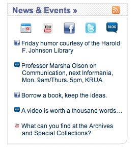

rss-cache-with-images
=====================

Take an RSS feed that's a combination of several, and label each item with an icon to show where it came from.

This is basically [RSSlib](http://www.synthium.net/feeds/docs.htm), but with some additional customization to show images, in order to categorize items in a combined feed. (This does not include the code to combine the feeds; it takes ONE feed as its input. I use a WordPress plugin to generate the combined feed; others might use FeedBurner or something similar. I would accept pull requests to do that work, though. ;))

Here's a screen shot of this script's output on a website (just the list with tiny icons):



If you need to refresh the feed, you can point your browser to http://[yourdomain]/rss-caching/rss-write-cache.php; it'll bring up a blank page, which means it's working. :)

If it says "cannot write to file," you or your sysadmin will need to change the owner of the file rss-cache.txt. On my server, I navigate into rss-caching and use the command

```sudo chown apache rss-cache.txt```

If you want the file to update regularly, you need to add something like this to crontab (the following makes it update every five minutes):

```*/5 * * * * /usr/bin/wget -O - -q -t 1 http://[yourdomain]/rss-caching/rss-write-cache.php```